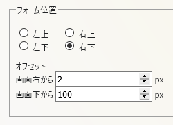

##  KOSHIAN 返信フォームを固定 改
このFirefoxアドオンはふたば☆ちゃんねるで返信フォームの位置を固定できる[Pachira](https://addons.mozilla.org/ja/firefox/user/anonymous-a0bba9187b568f98732d22d51c5955a6/)氏の[KOSHIAN 返信フォームを固定](https://addons.mozilla.org/ja/firefox/addon/koshian-float-form/)の非公式改変版です。  
返信フォームの幅や位置を設定するオプションをオリジナル版に追加しています。  

※このアドオンはWebExtensionアドオン対応のFirefox専用となります。  
※他のKOSHIAN改変版などのふたば閲覧支援ツールは[こちら](https://github.com/akoya-tomo/futaba_auto_reloader_K/wiki/)。  

## 機能
* オリジナルの機能（KOSHIAN 返信フォームを固定）
  - 返信フォームの位置を右下に固定
  - ボタンで返信フォームを開閉
  - マウスの位置で返信フォームを開閉
* 追加・修正された機能（KOSHIAN 返信フォームを固定 改）
  - 返信フォームの位置を変更（デフォルト：右下）  
    返信フォームの位置を右下以外に変更することができます。  
    返信フォームの横方向のオフセットも設定できます。（デフォルト：2px）  
      
  - 返信後に返信フォームを隠す（デフォルト：無効）  
    返信したら返信フォームが自動的に隠れます。  
  - スレを開いたときに返信フォームをロック（デフォルト：無効）  
    スレを開いたときに返信フォームのロックボタンをロックにします。  
    返信フォームの表示操作をボタンのみにすることができます。  
    （引用操作したときと「返信後に隠す」オプションは除く）  
  - 返信フォームの幅を設定（デフォルト：0 = 標準の幅）  
    返信フォームの幅を設定することができます。（単位：px）  
    0を設定するとオリジナル版と同じ幅で表示します。  
  - 返信フォーム内をクリックしたときに返信フォームが隠れないように修正  
    返信フォーム内で文字入力以外の操作をしたときに意図せずに隠れないように修正しました。  
    返信フォーム以外をクリックしたときは、ロックボタンがオフなら返信フォームが隠れます。  
  -  コメント欄にフォーカスしたらIMEをONにする（実験的機能）  
    廃止予定の機能を使用しているので実験的機能とします。  

## インストール
**GitHub**  

※「接続エラーのため、アドオンをダウンロードできませんでした。」と表示されてインストール出来ないときはインストールボタンを右クリックしてxpiファイルをダウンロードし、メニューのツール→アドオン（またはCtrl+Shift+A）で表示されたアドオンマネージャーのページにxpiファイルをドラッグ＆ドロップして下さい。  

## 注意事項
* 本アドオンを有効にしたときはオリジナル版を無効にするか削除して下さい。  
* オリジナル版とは別アドオンなので設定は初期値に戻ります。  
  再度設定をお願い致します。  
* 一度でもフォーム位置切替を行ってた場合フォームがちらつきます。  
  Firefoxのオプションの「プライバシーとセキュリティ」の「Cookieを表示」からimg.2chan.netやmay.2chan.netのreszcというCookieを削除すると解決します。  
  Firefox60以上では「プライバシーとセキュリティ」の「Cookieとサイトデータ」の「データを管理」からimg.2chan.netやmay.2chan.netのCookieを削除してください。

## 更新履歴
* v1.4.0 2019-09-11
  - コメント欄にフォーカスしたらIMEをONにする実験的機能を追加
  - KOSHIAN 引用メニュー 改で引用操作したらコメント欄にフォーカスするように修正
* v1.3.5 2018-08-09
  - 返信フォームの位置を微調整  
* v1.3.0 2018-08-09
  - 返信フォームの位置を変更する機能を追加  
  - 返信後に返信フォームを隠す機能を追加  
  - スレを開いたときに返信フォームをロックする機能を追加  
* v1.2.1 2018-08-06
  - 板によって返信フォーム内をクリックしたときに返信フォームが隠れてしまう不具合を修正  
* v1.2.0 2018-08-04
  - 返信フォーム内をクリックしたときに返信フォームが隠れないように修正  
* v1.1.0 2018-06-08
  - 「KOSHIAN 引用メニュー 改」で引用操作したときに返信フォームを表示するように修正  
    （要KOSHIAN 引用メニュー 改 v1.2以上）
* v1.0.0 2018-05-06
  - KOSHIAN 返信フォームを固定 v1.0.6ベース
  - 返信フォームの幅を設定するオプションを追加
  - その他細かな修正
